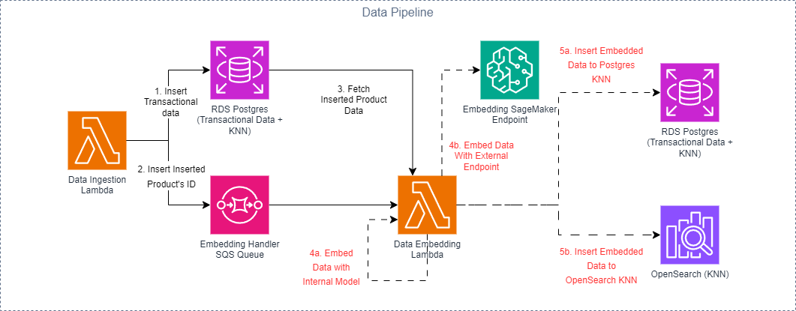
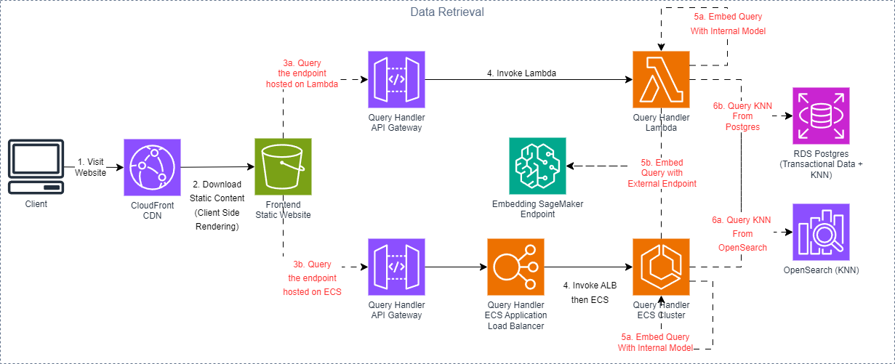

# PyConHK2023-Clean-Architecture

This is the code repository for all the frontend, backend and CI/CD code used for deployment

# Table of Contents
* [How to get started](#how-to-get-started)
    * [GitHub Secrets](#github-secrets)
* [Code Repository Structure](#code-repository-structure)
    * [Artifacts](#artifacts)
        * [Sentence Bert Onnx Transform Script (artifacts/sentence_bert_onnx_transform)](#sentence-bert-onnx-transform-script-artifactssentence_bert_onnx_transform)
    * [Backend](#backend)
        * [Data Ingestion Handler (backend/data_ingestion_handler)](#data-ingestion-handler-backenddata_ingestion_handler)
        * [Data Embedding Handler (backend/data_embedding_handler)](#data-embedding-handler-backenddata_embedding_handler)
        * [Query Handler (backend/query_handler)](#query-handler-backendquery_handler)
    * [Data (data)](#data-data)
    * [Docs (docs)](#docs-docs)
    * [Frontend (frontend/pyconhk2023_query_handler_frontend)](#frontend-frontendpyconhk2023_query_handler_frontend)
    * [SageMaker Endpoint (sagemaker/embedding_model)](#sagemaker-endpoint-sagemakerembedding_model)
    * [Scripts (scripts)](#scripts-scripts)
    * [Terraform (terraform)](#terraform-terraform)
* [Resources Diagram](#resources-diagram)
* [Architectural Diagram](#architectural-diagram)
    * [Data Ingestion Pipeline](#data-ingestion-pipeline)
    * [Query Pipeline](#query-pipeline)
* [Related Resources from PyCon HK 2023](#related-resources-from-pycon-hk-2023)

## How to get started

You may fork this repository and reference it in your own repository. You may also use this repository as a template. Feel free to use it as you wish.

### GitHub Secrets

This repository defines several GitHub secrets that are required for the CI/CD pipeline to work. You should define them in your own repository, or you can change the corresponding `terraform/variable.tf` file to use your own variables.

- `ALLOWED_CIDRS`: A list of CIDRs to allow access to the resources, comma-separated string.

- `BASTION_SSH_PUBLIC_KEY`: The OpenSSH public key to be added to the bastion host, in PEM format.

- `AWS_REGION`: The AWS region you are deploying your resources to.

- `CICD_ASSUME_ROLE_ARN`: The CICD role ARN to assume. It will be responsible for deploying the resources in AWS. This role should have **OIDC** trust policy for this repository enabled.

## Code Repository Structure

### Artifacts

#### Sentence Bert Onnx Transform Script (`artifacts/sentence_bert_onnx_transform`)

This module defines a script that can transform any pretrained [Sentence Bert](https://huggingface.co/sentence-transformers) model into an onnx model. The transformed onnx model can be used in the lambda function / api server with a smaller memory footprint and faster initialization speed.

```bash
.
├── README.md
├── poetry.lock
├── pyproject.toml
├── requirements.txt
├── src
│   ├── __init__.py
│   └── sentence_bert_onnx_transform.py
└── tests
    └── __init__.py
```

### Backend

#### Data Ingestion Handler (`backend/data_ingestion_handler`)

This handler is a lambda function that is triggered by an EventBridge scheduled event every hour (or manually). It will fetch the latest product details from the S3 bucket, upsert the data into DB and send the product id to the SQS queue.

```bash
.
├── README.md
├── poetry.lock
├── pyproject.toml
├── requirements.txt
├── src
│   ├── __init__.py
│   ├── adapters
│   │   ├── __init__.py
│   │   └── upsert_raw_product_details
│   │       ├── __init__.py
│   │       ├── aws_sqs.py
│   │       └── postgres.py
│   ├── deployments
│   │   ├── __init__.py
│   │   └── lambda
│   │       ├── __init__.py
│   │       ├── app.py
│   │       └── config.py
│   ├── entities
│   │   ├── __init__.py
│   │   └── raw_product_details.py
│   └── usecases
│       ├── __init__.py
│       └── upsert_raw_product_details.py
└── tests
    └── __init__.py
```

Important Packages:
- psycopg2 (Upsert data into DB)
- boto3 (Send message to SQS queue, fetch data from S3 bucket)

#### Data Embedding Handler (`backend/data_embedding_handler`)

This handler is a lambda function that is triggered by an SQS queue. It will fetch the product id from the SQS queue, fetch the product details from the DB, embed the product details into text embedding and upsert the embedded data to database. 

```bash
.
├── README.md
├── dockerfile
├── poetry.lock
├── pyproject.toml
├── requirements.txt
├── src
│   ├── __init__.py
│   ├── adapters
│   │   ├── __init__.py
│   │   ├── embed_raw_product_details
│   │   │   ├── __init__.py
│   │   │   ├── aws_sagemaker.py
│   │   │   └── onnx.py
│   │   ├── fetch_raw_product_details
│   │   │   ├── __init__.py
│   │   │   └── postgres.py
│   │   └── upsert_embedded_product_details
│   │       ├── __init__.py
│   │       ├── opensearch.py
│   │       └── postgres.py
│   ├── deployments
│   │   ├── __init__.py
│   │   └── lambda
│   │       ├── __init__.py
│   │       ├── app.py
│   │       └── config.py
│   ├── entities
│   │   ├── __init__.py
│   │   ├── embedded_product_details.py
│   │   └── raw_product_details.py
│   └── usecases
│       ├── __init__.py
│       ├── embed_raw_product_details.py
│       ├── fetch_raw_product_details.py
│       └── upsert_embedded_product_details.py
└── tests
    └── __init__.py
```

There are 2 options for embedding the text data (implemented in `src/adapters/embed_raw_product_details`)
1. AWS SageMaker (Requires calling an AWS SageMaker endpoint. See section [SageMaker Endpoint](#sagemaker-endpoint))
2. Running onnxruntime with the pre-built embedding model. Check `.github/workflows/prod.yaml` for more information.

There are also 2 options for inserting the data into database. Currently, both
1. Postgres DB (with extension [pgvector](https://github.com/pgvector/pgvector) enabled)
2. OpenSearch (with settings `index.knn = true` enabled)
are available.

Normally, the handler should only upsert the data into one of the database. However, for the sake of demonstration, this handler will insert the data into both databases.

Important Packages:
- psycopg2 (Fetch, upsert data into DB)
- boto3 (Fetch product ids from SQS queue, calling AWS SageMaker Endpoint)
- transformers (Tokenize product details into tokens)
- onnxruntime (Embed tokenized product details into text embedding)
- opensearch-py (Upsert embedded data to OpenSearch)

#### Query Handler (`backend/query_handler`)

This handler contains both a lambda and ECS (FastAPI server) backend protected by API Gateway. Both of them responsible for the following steps:
1. Embed (tokenize + inference) user incoming text queries into text embeddings
2. Query one of the KNN Search database to find the `K`-most similar products from the database.
3. Retrieve those `K`-most similar products details back to client.

```bash
.
├── README.md
├── dockerfile.api_server
├── dockerfile.lambda
├── poetry.lock
├── pyproject.toml
├── requirements.api_server.txt
├── requirements.lambda.txt
├── src
│   ├── __init__.py
│   ├── adapters
│   │   ├── __init__.py
│   │   ├── embed_raw_query_details
│   │   │   ├── __init__.py
│   │   │   ├── aws_sagemaker.py
│   │   │   └── onnx.py
│   │   ├── fetch_raw_product_details
│   │   │   ├── __init__.py
│   │   │   └── postgres.py
│   │   └── query_similar_product_details
│   │       ├── __init__.py
│   │       ├── opensearch.py
│   │       └── postgres.py
│   ├── deployments
│   │   ├── __init__.py
│   │   ├── api_fastapi
│   │   │   ├── __init__.py
│   │   │   ├── config.py
│   │   │   ├── main.py
│   │   │   ├── routes
│   │   │   │   ├── __init__.py
│   │   │   │   ├── health_status
│   │   │   │   │   ├── __init__.py
│   │   │   │   │   ├── api_models.py
│   │   │   │   │   ├── api_schema.py
│   │   │   │   │   ├── lifespan.py
│   │   │   │   │   └── route.py
│   │   │   │   └── similar_products
│   │   │   │       ├── __init__.py
│   │   │   │       ├── api_models.py
│   │   │   │       ├── api_schema.py
│   │   │   │       ├── lifespan.py
│   │   │   │       └── route.py
│   │   │   └── utils
│   │   │       ├── __init__.py
│   │   │       ├── api_response.py
│   │   │       └── logging.py
│   │   └── lambda
│   │       ├── __init__.py
│   │       ├── app.py
│   │       └── config.py
│   ├── entities
│   │   ├── __init__.py
│   │   ├── query_details.py
│   │   └── raw_product_details.py
│   └── usecases
│       ├── __init__.py
│       ├── embed_raw_query_details.py
│       ├── fetch_raw_product_details.py
│       └── query_similar_product_details.py
└── tests
    └── __init__.py
```

There are 2 options for embedding the text data (implemented in `src/adapters/embed_raw_product_details`)
1. AWS SageMaker (Requires calling an AWS SageMaker endpoint. See section [SageMaker Endpoint](#sagemaker-endpoint))
2. Running onnxruntime with the pre-built embedding model. Check `.github/workflows/prod.yaml` for more information.

There are also 2 options for querying the data from database. Currently, both
1. Postgres DB (with extension [pgvector](https://github.com/pgvector/pgvector) enabled)
2. OpenSearch (with settings `index.knn = true` enabled)
are available.

Normally, the handler should only query the data from one of the database. However, for the sake of demonstration, **each of the handler will take unique combination of embedding method and KNN search method to demonstrate how clean architecture works**.

Packages:
- psycopg2 (Fetch, upsert data into DB)
- boto3 (Fetch product ids from SQS queue, calling AWS SageMaker Endpoint)
- transformers (Tokenize product details into tokens)
- onnxruntime (Embed tokenized product details into text embedding)
- opensearch-py (Upsert embedded data to OpenSearch)
- fastapi (Serve the endpoint)

### Data (`data`)
This folder contains the data used for the project. Currently, it contains a sampled tv, media products details in the `sampled_valid_images_dedup_tv_audio_camera_df.csv` file.

This dataset is retrieved from [Kaggle](https://www.kaggle.com/datasets/lokeshparab/amazon-products-dataset) with some post-processing. All the data used are in the main category of tv, audio & cameras.

### Docs (`docs`)
This folder contains the documentation and related images for the project.

### Frontend (`frontend/pyconhk2023_query_handler_frontend`)

The frontend code is a React-SPA application using tailwindcss and DaisyUI for styling. It is deployed to AWS S3 bucket and served by AWS CloudFront.

```bash
.
├── README.md
├── index.html
├── package-lock.json
├── package.json
├── postcss.config.js
├── public
│   └── single_mahjong.png
├── src
│   ├── App.tsx
│   ├── contexts
│   │   └── isLoading.tsx
│   ├── display
│   │   ├── index.tsx
│   │   └── productCard.tsx
│   ├── index.css
│   ├── main.tsx
│   ├── navBar
│   │   └── index.tsx
│   ├── types.tsx
│   └── vite-env.d.ts
├── tailwind.config.js
├── tsconfig.json
├── tsconfig.node.json
└── vite.config.ts
```

### SageMaker Endpoint (`sagemaker/embedding_model`)

This module defines a SageMaker endpoint that can be used to embed text data into text embeddings. It is deployed using AWS SageMaker and uses the same model as the one used in the lambda function, produced by the script in `artifacts/sentence_bert_onnx_transform`.

```bash
.
├── dockerfile
├── requirements.txt
└── src
    ├── __init__.py
    ├── config.py
    └── main.py
```

The endpoint is served by a FastAPI server.

Important Packages:
- onnxruntime (Embed tokenized product details into text embedding)
- transformers (Tokenize product details into tokens)
- fastapi (Serve the endpoint)

### Scripts (`scripts`)
This folder contains scripts that are used for deployment.

- `opensearch_create_embedded_products_mapping.json`: Defines the mapping for the OpenSearch index that stores the embedded product details.

- `postgres_create_raw_products.sql`: Defines the SQL query for creating the table that stores the raw product details.

- `postgres_create_embedded_products.sql`: Defines the SQL query for creating the table that stores the embedded product details.`

### Terraform (`terraform`)
This folder contains the terraform code for deploying the resources to AWS.

```bash
.
├── apigateway.tf
├── backend.tf
├── cloudfront.tf
├── data.tf
├── ecs.tf
├── eventbridge.tf
├── lambda.tf
├── locals.tf
├── modules
│   └── secretsmanager
│       ├── main.tf
│       ├── outputs.tf
│       └── variable.tf
├── opensearch.tf
├── outputs.tf
├── provider.tf
├── rds.tf
├── s3.tf
├── sagemaker.tf
├── secretsmanager.tf
├── sqs.tf
├── terraform.tfvars
├── variable.tf
└── vpc.tf
```

For all the resources deployed, please refer to the [Resources Diagram](#resources-diagram) section.

## Resources Diagram

## Architectural Diagram

### Data Ingestion Pipeline



### Query Pipeline



## Related Resources from PyCon HK 2023

- [PyCon HK 2023 Proposal](https://pycon.hk/2023/as-soft-as-ever-changing-clean-architecture-in-python/)

- [Powerpoint Slides](https://1drv.ms/ps!AuHrIoMSVvdAmiWS3CyuMhsRuznx?e=O6dUvP)

- [Demo Page (Available Until 2023-11-13)](https://d35kt7gcj9v3gx.cloudfront.net)